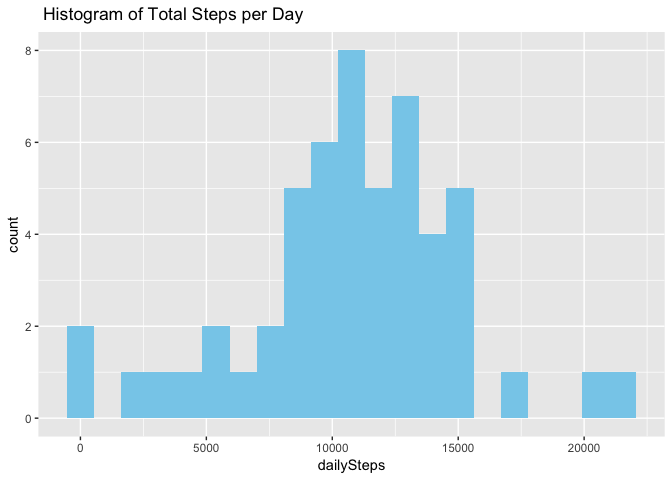

Assignment Brief
----------------

This assignment makes use of data from a personal activity monitoring
device. This device collects data at 5 minute intervals through out the
day. The data consists of two months of data from an anonymous
individual collected during the months of October and November, 2012 and
include the number of steps taken in 5 minute intervals each day.

The main artifact of the the entire assignment is the summary report in
a single R markdown document that can be processed by knitr and be
transformed into an HTML file. The summary report answers various
questions that details the patterns found in the data as well the
process to process that data and arrive at the report.

Loading and Preprocessing Data
------------------------------

This section shows the steps required to read the fitness data from the
CSV file. The report assumes that the required file is already
downloaded into the working directory of R/R Studio.

    unzip("coursera/repdata%2Fdata%2Factivity.zip")

    ## Warning in unzip("coursera/repdata%2Fdata%2Factivity.zip"): error 1 in
    ## extracting from zip file

    activityData <- tbl_df(read.csv("activity.csv", header = TRUE, stringsAsFactors = FALSE))

### Summary of Raw Data

    str(activityData)

    ## Classes 'tbl_df', 'tbl' and 'data.frame':    17568 obs. of  3 variables:
    ##  $ steps   : int  NA NA NA NA NA NA NA NA NA NA ...
    ##  $ date    : chr  "2012-10-01" "2012-10-01" "2012-10-01" "2012-10-01" ...
    ##  $ interval: int  0 5 10 15 20 25 30 35 40 45 ...

    head(activityData)

    ## # A tibble: 6 × 3
    ##   steps       date interval
    ##   <int>      <chr>    <int>
    ## 1    NA 2012-10-01        0
    ## 2    NA 2012-10-01        5
    ## 3    NA 2012-10-01       10
    ## 4    NA 2012-10-01       15
    ## 5    NA 2012-10-01       20
    ## 6    NA 2012-10-01       25

    summary(activityData)

    ##      steps            date              interval     
    ##  Min.   :  0.00   Length:17568       Min.   :   0.0  
    ##  1st Qu.:  0.00   Class :character   1st Qu.: 588.8  
    ##  Median :  0.00   Mode  :character   Median :1177.5  
    ##  Mean   : 37.38                      Mean   :1177.5  
    ##  3rd Qu.: 12.00                      3rd Qu.:1766.2  
    ##  Max.   :806.00                      Max.   :2355.0  
    ##  NA's   :2304

### Data Preprocessing

Convert the date column from character to date class so it can be used
in the processing correctly.

    activityData$date <- ymd(activityData$date)
    str(activityData)

    ## Classes 'tbl_df', 'tbl' and 'data.frame':    17568 obs. of  3 variables:
    ##  $ steps   : int  NA NA NA NA NA NA NA NA NA NA ...
    ##  $ date    : Date, format: "2012-10-01" "2012-10-01" ...
    ##  $ interval: int  0 5 10 15 20 25 30 35 40 45 ...

Data Analysis
-------------

The sections below will provide analysis on various aspects of the data.

Analysis on Total Steps per Day
-------------------------------

### Total Steps per Day

    totalSteps <- activityData %>%
            filter(!is.na(steps)) %>%
            group_by(date) %>%
            summarize(dailySteps = sum(steps)) %>%
            print()

    ## # A tibble: 53 × 2
    ##          date dailySteps
    ##        <date>      <int>
    ## 1  2012-10-02        126
    ## 2  2012-10-03      11352
    ## 3  2012-10-04      12116
    ## 4  2012-10-05      13294
    ## 5  2012-10-06      15420
    ## 6  2012-10-07      11015
    ## 7  2012-10-09      12811
    ## 8  2012-10-10       9900
    ## 9  2012-10-11      10304
    ## 10 2012-10-12      17382
    ## # ... with 43 more rows

### Mean and Median of Total Steps per Day

    meanSteps <- mean(totalSteps$dailySteps)
    meanSteps

    ## [1] 10766.19

    medianSteps <- median(totalSteps$dailySteps)
    medianSteps

    ## [1] 10765

### Histogram of Total Steps per Day

    binWidth = medianSteps / 10 
    histogram <- ggplot(totalSteps, aes(dailySteps)) + geom_histogram(fill = "skyblue", binwidth = binWidth) + labs(title = " Histogram of Total Steps per Day")
    print(histogram)

Analysis on Average Steps per Interval
--------------------------------------

### Average Steps per Interval

    averageStepsInterval <- activityData %>%
            filter(!is.na(steps)) %>%
            group_by(interval) %>%
            summarize(avgSteps = mean(steps))
    head(averageStepsInterval)

    ## # A tibble: 6 × 2
    ##   interval  avgSteps
    ##      <int>     <dbl>
    ## 1        0 1.7169811
    ## 2        5 0.3396226
    ## 3       10 0.1320755
    ## 4       15 0.1509434
    ## 5       20 0.0754717
    ## 6       25 2.0943396

    summary(averageStepsInterval)

    ##     interval         avgSteps      
    ##  Min.   :   0.0   Min.   :  0.000  
    ##  1st Qu.: 588.8   1st Qu.:  2.486  
    ##  Median :1177.5   Median : 34.113  
    ##  Mean   :1177.5   Mean   : 37.383  
    ##  3rd Qu.:1766.2   3rd Qu.: 52.835  
    ##  Max.   :2355.0   Max.   :206.170

### Line Plot of Average Steps per 5 minute Interval

    lineplot <- ggplot(averageStepsInterval, aes(interval, avgSteps)) + geom_line(color = "violet")  + labs(title = " Line Plot of Average Steps per 5-Minute Interval")
    print(lineplot)

### Maximum of Average Steps per 5 minute Interval

    maxAverageSteps <- max(averageStepsInterval$avgSteps)
    print(maxAverageSteps)

    ## [1] 206.1698

Imputing Missing Values
-----------------------

### Number of Missing Values

    missingValues <- sum(is.na(activityData$steps))
    print(missingValues)

    ## [1] 2304

### Impute Missing Values with average steps

Impute missing values of steps with the average steps for that
corresponding 5 minute interval.

    activityData$steps <- ifelse(is.na(activityData$steps),tapply(activityData$steps, activityData$interval, mean, na.rm = TRUE), activityData$steps) 
    summary(activityData)

    ##      steps             date               interval     
    ##  Min.   :  0.00   Min.   :2012-10-01   Min.   :   0.0  
    ##  1st Qu.:  0.00   1st Qu.:2012-10-16   1st Qu.: 588.8  
    ##  Median :  0.00   Median :2012-10-31   Median :1177.5  
    ##  Mean   : 37.38   Mean   :2012-10-31   Mean   :1177.5  
    ##  3rd Qu.: 27.00   3rd Qu.:2012-11-15   3rd Qu.:1766.2  
    ##  Max.   :806.00   Max.   :2012-11-30   Max.   :2355.0

The summary shows that there are no missing values for steps in the
dataframe now.

Total Steps per day Analysis after imputing the missing values
--------------------------------------------------------------

### Total Steps per Day (Imputed)

    totalSteps <- activityData %>%
            filter(!is.na(steps)) %>%
            group_by(date) %>%
            summarize(dailySteps = sum(steps)) %>%
            print()

    ## # A tibble: 61 × 2
    ##          date dailySteps
    ##        <date>      <dbl>
    ## 1  2012-10-01   10766.19
    ## 2  2012-10-02     126.00
    ## 3  2012-10-03   11352.00
    ## 4  2012-10-04   12116.00
    ## 5  2012-10-05   13294.00
    ## 6  2012-10-06   15420.00
    ## 7  2012-10-07   11015.00
    ## 8  2012-10-08   10766.19
    ## 9  2012-10-09   12811.00
    ## 10 2012-10-10    9900.00
    ## # ... with 51 more rows

### Mean and Median of Total Steps per Day (Imputed)

    meanSteps <- mean(totalSteps$dailySteps)
    meanSteps

    ## [1] 10766.19

    medianSteps <- median(totalSteps$dailySteps)
    medianSteps

    ## [1] 10766.19

### Histogram of Total Steps per Day (Imputed)

    binWidth = medianSteps / 10 
    histogram <- ggplot(totalSteps, aes(dailySteps)) + geom_histogram(fill = "skyblue", binwidth = binWidth) + labs(title = " Histogram of Total Steps per Day (Imputed)")
    print(histogram)

-1.png)

### Result

-   The mean and median are the same once the missing values
    are imputed.
-   The median remains the same as before.
-   The frequency of steps per day has increased across the x-axis as
    missing values have been replaced

Activity Pattern - Week Day vs Weekend
--------------------------------------

### Add a new column

    activityData$WeekType <- ifelse(weekdays(activityData$date) %in% c("Saturday", "Sunday"),"Weekend", "Weekday")
    head(activityData)

    ## # A tibble: 6 × 4
    ##       steps       date interval WeekType
    ##       <dbl>     <date>    <int>    <chr>
    ## 1 1.7169811 2012-10-01        0  Weekday
    ## 2 0.3396226 2012-10-01        5  Weekday
    ## 3 0.1320755 2012-10-01       10  Weekday
    ## 4 0.1509434 2012-10-01       15  Weekday
    ## 5 0.0754717 2012-10-01       20  Weekday
    ## 6 2.0943396 2012-10-01       25  Weekday

    table(activityData$WeekType)

    ## 
    ## Weekday Weekend 
    ##   12960    4608

### Line Plot of Week Day vs Weekend

    avgIntervalWeek <- activityData %>%
            group_by(interval, WeekType) %>%
            summarize(avgSteps = mean(steps))

    linePlot <- ggplot(avgIntervalWeek, aes(interval, avgSteps, color = WeekType)) + geom_line() + facet_wrap(~WeekType, ncol = 1, nrow = 2)
    print(linePlot)

### Result

-   The weekend is more evenly distributed than the weekday
    average steps.
-   The peak number of average steps happens early over the weekdays
    than weekend.
